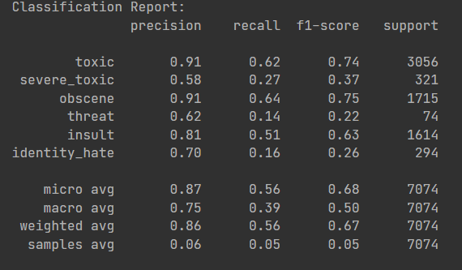
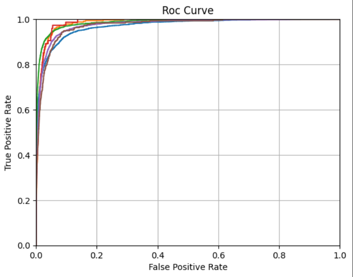

# **Toxic Comments - Multi Label Classification**

This ML model classifies text on various types of toxic content it containts 

These toxic Lables include:
>toxic \
severe_toxic \
obscene \
threat \
insult \
>identity_hate 

# **Useful Links**

Live Project : [toxiccommentsclassifier.streamlit.app](https://toxiccommentsclassifier.streamlit.app/) \
Dataset : [Kggle](https://www.kaggle.com/competitions/jigsaw-toxic-comment-classification-challenge/data)

# **Techniques Used**
- *Natural Language Processing*
- *Logistic regression*
- *Multi-Nomial Naive Bayes Classification*
- *One Vs Rest Classification*


## **Text Proprocessing:** 
The Pre Processing is done in 3 steps:
1. *Stop Words Removal*
2. *Text cleaning*
    - Converting the text to lowercase
    - Removing Punctuations
3. *Stemming the text*

## **Libraries used:**
- `scikit-learn`
- `pandas`
- `numpy`
- `matplotlib`
- `seaborn`
- `streamlit`
- `nltk`


## **Metrics Used:** 
- **Roc-Auc** 


- **Accuracy** 


- **Classification Report**

- **Roc Curve**


---
# **Running the Model**
To run the Web App Model, follow these steps:

### **Install the requirements for Streamlit App** by running 
```bash
pip install -r requirements.txt`
```
### **Run the Streamlit App using the following command:** 
```bash
streamlit run Webapp.py
```